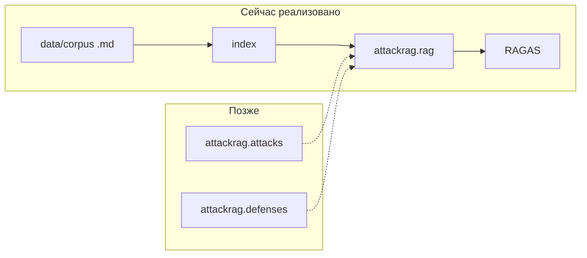

# Архитектура репозитория AttackRAG

## Главное, чтобы не путаться

| Что | Что это |
|-----|---------|
| **Репозиторий `AttackRAG`** | Название **всего** проекта диссертации (атаки, защиты, стенд). |
| **Пакет `attackrag`** (папка `src/attackrag/`) | Один устанавливаемый Python-модуль со **всем кодом** стенда: сейчас там **только baseline RAG и оценка**, без реализации атак. |
| **Папки `attackrag/attacks/` и `attackrag/defenses/`** | Зарезервированы под код атак и защит **позже**; сейчас пустые заглушки. |

Имя **`attack_pipeline` больше не используется** — оно звучало так, будто атаки уже «в конвейере», и сбивало с толку.

## Зачем вся логика в `src/attackrag/`

В Python-проектах принято класть библиотеку в `src/<имя_пакета>/`, чтобы:

- `pip install -e .` ставил один пакет с предсказуемым именем;
- импорты были `from attackrag.rag import ...`, без коллизий с другими модулями.

Сюда же потом лягут `attacks` и `defenses` — это **один продукт** (стенд), а не три отдельных репозитория.

## Структура пакета (как сейчас и что будет)

```text
src/attackrag/
├── __init__.py              # публичный вход: RAGConfig, RAGPipeline
├── paths.py                 # пути к data/ в корне репо
├── documents.py             # загрузка .md корпуса
├── chunking.py              # разбиение на чанки (фрагменты D)
├── embeddings.py            # E
├── vector_index.py          # индекс I + retrieval R
├── llm.py                   # вызовы LLM (G)
├── rag.py                   # шаблон промпта T + склейка RAG
├── ragas_eval.py            # прогон golden QA + метрики RAGAS
├── attacks/                 # ← сюда позже: PI, poisoning, SECRET, …
│   └── __init__.py
├── defenses/                # ← сюда позже: фильтры, верификатор, …
│   └── __init__.py
└── cli/                     # команды `attack-rag-*`
    ├── build_index.py
    ├── run_ragas.py
    └── corpus/
        └── fetch_wikipedia.py
```

**Снаружи пакета:**

- `apps/streamlit_app.py` — демо-интерфейс (импортирует `attackrag`).
- `data/` — корпус, golden QA, сгенерированный индекс (часть в `.gitignore`).

## Поток данных (упрощённо)



## Соответствие диссертации

| Формализация | Код сейчас |
|--------------|------------|
| D, чанки | `documents`, `chunking`, файлы в `data/` |
| E, I, R | `embeddings`, `vector_index` |
| T, G | `rag`, `llm` |
| Легитимное качество | `ragas_eval`, `golden_qa.json` |
| Атаки / Def | `attacks/`, `defenses/` (пока заглушки) |
